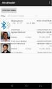

# BLE Beacon Logger App

Android application to scan and log BLE beacon messages. Supports decoding data from the transient BLE node and logging the data to a log file.

## Getting Started

Install an up to date version of Android Studio (version 3.6 at publication time) to open and compile the project.
Once loaded you should be able to compile and install the application on your Android device.

When running the application for the first time, you'll be asked to grant Bluetooth and Location Permissions which are both mandatory for scanning for BLE packets.
Apart from scanning for BLE beacons, the application does not access any location services. Further the Storage Permission is required for writing the received data to a logfile.

## Application Overview

1. Start/Stop scanning for BLE beacons.

2. Filter BLE devices to process. The list entries and corresponding MAC addresses can be configured in the `app/src/main/res/values/strings.xml` file by extending/modifying the `ble_filter_entries` and `ble_filter_values` lists.

3. List of recently received BLE beacons. Display duration and decoding of the transient BLE node data can be configured in the settings. Depending on where the MiroCard is assigned to a person or a location, the data is visualized differently. 
   
   Data displayed for personal MiroCards
   - User picture 
   - User name and info 
   - Sender MAC address
   - Received signal strength indicator (RSSI)
   - Local timestamp (nanoseconds from arbitrary reference, see Java's `System.nanoTime()` documentation)

   Data displayed for non-personal MiroCards:
   - Bluetooth icon
   - Device name (if available)
   - Decoded data and sender timestamp (hex string) when decoding or raw payload data (hex string)
   - Sender MAC address
   - Received signal strength indicator (RSSI)
   - Local timestamp (nanoseconds from arbitrary reference, see Java's `System.nanoTime()` documentation)

4. Settings: configure BLE scan mode, data decoding, enable/disable logging to file, and more.

## Contributors

* Lukas Sigrist
* Kevin Luchsinger
* Andres Gomez
